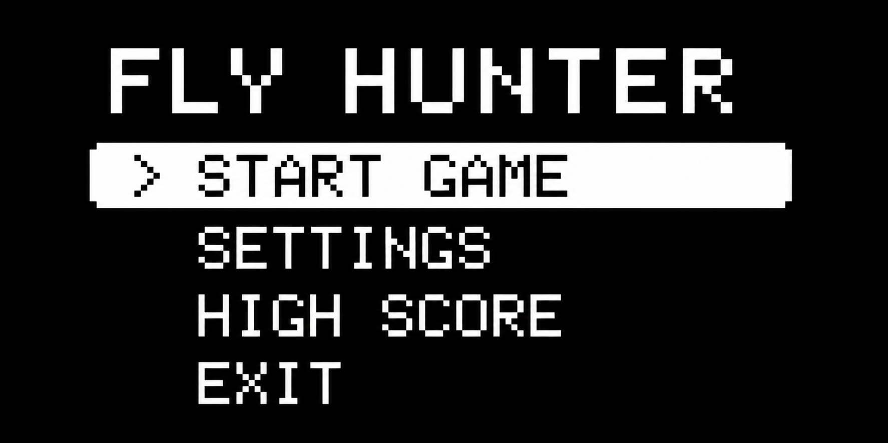
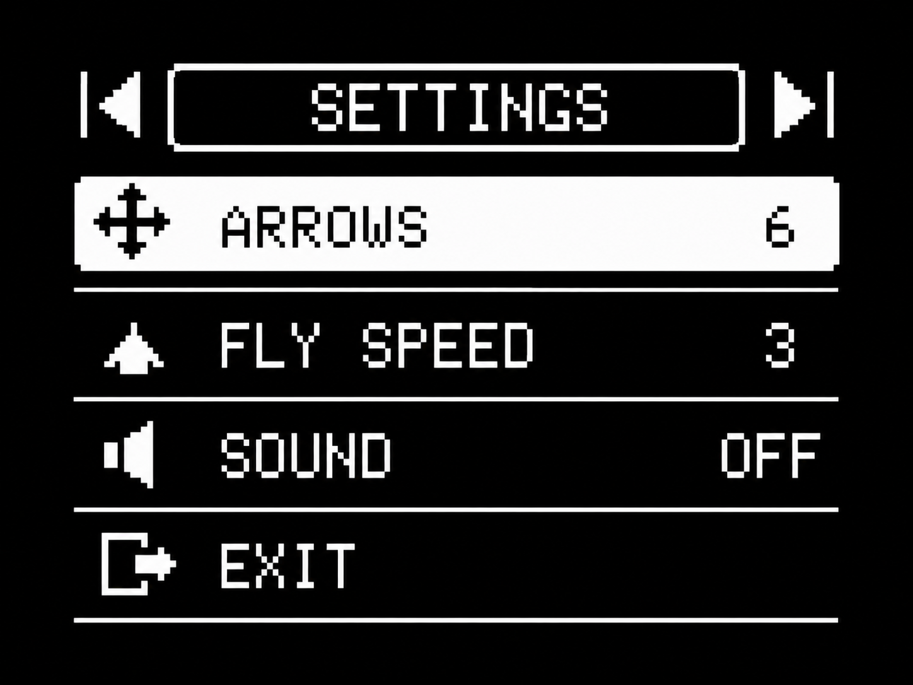
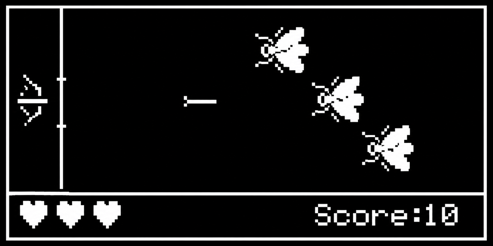
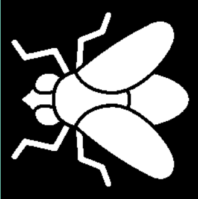
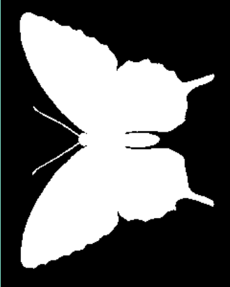
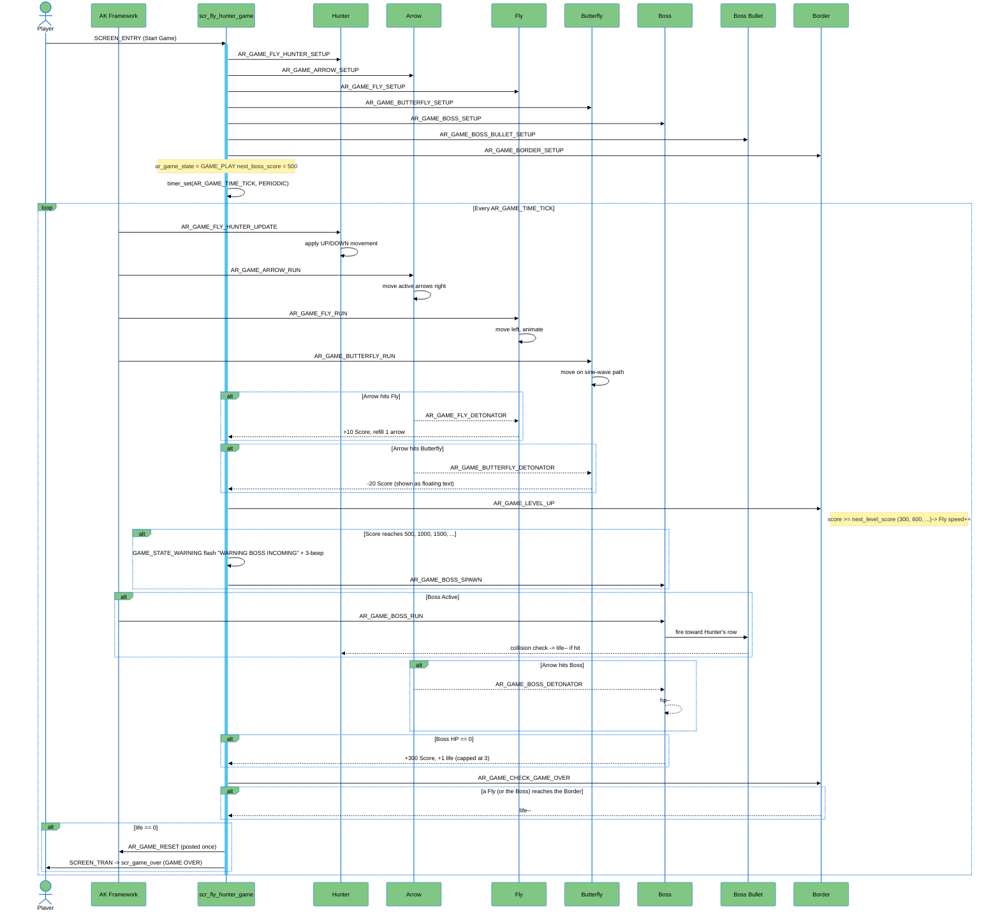

# Fly Hunter Game

<div align="center">
  <video src="https://github.com/user-attachments/assets/e24911bf-5073-4d07-a8e8-738927585d1b" controls width="480"></video>


</div>                            

---
## Documentation                            

| File | Description |
|---|---|
| [README.md](./README.md) | Project overview (this file) |
| [docs/01-guide-getting-started.md](./docs/01-guide-getting-started.md) | How to build, flash and run the project |
| [docs/02-guide-coding-rules.md](./docs/02-guide-coding-rules.md) | Coding conventions used in this project |
| [docs/03-design-sequence-object.md](./docs/03-design-sequence-object.md) | Sequence diagrams for each game object |
| [docs/04-design-sequence-runtime.md](./docs/04-design-sequence-runtime.md) | Runtime signal/message flow |


## Introduction                            

**Fly Hunter** is a 2D shooting mini-game built on the AK Embedded Base Kit, inspired by classic side-scrolling shooters. The player controls a hunter standing at a fixed border on the left side of the screen, aiming and shooting arrows at incoming Flies before they cross the border, while avoiding a decoy **Butterfly** that punishes careless shots. Every few hundred points, a **Boss** appears with its own HP bar and bullet attacks, raising the difficulty and testing the player's reflexes.

Like other embedded games built on the AK platform, Fly Hunter is also a practical showcase of embedded system design concepts:
- **System design** — screens and game objects organized as independent, event-driven modules (UML-style).
- **Process management** — each game object (Hunter, Arrow, Fly, Butterfly, Boss, Boss Bullet, Bang, Border) is handled as its own task with its own message handler.
- **Communication** — objects talk to each other purely through **Signal / Timer / Message**, no direct function coupling.
- **Control logic** — screen navigation is implemented as a **Finite State Machine**, and gameplay difficulty scales through a simple state machine.


### I. Hardware            

<table align="center">
  <tr>              
    <td align="center"></td>
  </tr>    
</table>      
<p align="center"><strong><em>Figure 1:</em></strong> AK Embedded Base Kit - STM32L151</p>

[AK Embedded Base Kit](https://epcb.vn/products/ak-embedded-base-kit-lap-trinh-nhung-vi-dieu-khien-mcu) is an evaluation kit aimed at intermediate and advanced embedded software learners.

The kit integrates a **1.54" OLED LCD**, **3 push buttons**, and **a buzzer** capable of playing short melodies, giving you everything you need to study **event-driven systems** through hands-on game-machine design.
It also exposes **RS485**, the **Qwiic Connect System**, and **Grove** connectors, so it doubles as a convenient prototyping board for real-world embedded projects.

**MCU Overview:**

```text
SoC Name : STM32L151CBT6
RAM      : 16 KB

Flash Partitions Layout
----------------------
[ 0x08000000 - 0x08001FFF ] : Bootloader Partition (8 KB)
=> AK Bootloader

[ 0x08002000 - 0x08002FFF ] : BSF Shared Partition (4 KB)
=> Used for data sharing between Bootloader and Application

[ 0x08003000 - 0x0801FFFF ] : Application Partition (116 KB)
=> Fly hunter firmware
```

**MCU Naming Convention:**

| Part | Meaning |
|---|---|
| `STM32` | STMicroelectronics 32-bit MCU family. |
| `L` | Low-power series. |
| `151` | STM32L151 product line. |
| `C` | 48-pin package. |
| `B` | 128 KB Flash memory. |
| `T` | LQFP package. |
| `6` | Industrial temperature grade. |


<table align="center">
  <tr>
    <td align="center"></td>
  </tr>
</table>
<p align="center"><strong><em>Figure 2:</em></strong> Board view Top + Bottom </p>

### II - Game Description and Objects

The following section describes the gameplay and core mechanics of Fly Hunter. It serves as a reference for understanding the game's mechanics and firmware implementation.

<table align="center">
  <tr>
    <td align="center"></td>
  </tr>
</table>
<p align="center"><strong><em>Figure 3:</em></strong> Menu screen</p>

<table align="center">
  <tr>
    <td align="center"></td>
  </tr>
</table>
<p align="center"><strong><em>Figure 4:</em></strong> Setting screen</p>

When the game starts, the Main Menu is displayed with the following options:

- **Start Game:** Begin a new game.
- **Settings:** Configure gameplay parameters such as sound and difficulty.
- **High Score:** Display the top three highest scores saved in memory.
- **Exit:** Return to the idle screen.


<p align="center"> <br> <em><b>Figure 5.</b> Gameplay Screen</em> </p>

During gameplay, the player controls a hunter positioned on the left side of the screen. The objective is to shoot incoming Flies while avoiding the Butterfly decoy and surviving Boss encounters.

#### Objects in the Game:

| Object | Bitmap | Description |
|---|---|---|
| **Hunter** | <p align="center"></p>| The player character. Stands at the shooting position and fires arrows.|
| **Arrow** | <p align="center"></p>| Projectile fired by the Hunter. Travels across the screen and destroys any Fly, Butterfly, or Boss it hits. |
| **Fly** | <p align="center"></p> | The main enemy wave. Flies in from the right side toward the border on the left. If it crosses the border, the player loses one life. Spawn speed increases as the score rises. |
| **Butterfly** | <p align="center"></p> | A decoy object. Shows a floating `-20` text and penalizes the score when involved, adding risk/reward to the fight. |
| **Boss** | <p align="center"></p> | A large enemy that spawns once the score passes a threshold. |
| **Boss Bullet** | <p align="center"></p> | Projectile fired back by the Boss at the player. |
| **Bang (Explosion)** | <p align="center"></p>| Generic explosion effect played whenever an object is destroyed. |
| **Border** | <p align="center"></p> | The "kill line" on the left edge of the play area. Enemies crossing it cost the player a life; the border flashes white when the player is hit. |
| **Heart** |<p align="center"></p> | Displayed at the bottom-left of the HUD to represent the player's remaining lives. |

### III - How to Play

**Controls:**  
- **MODE** — Shoot an arrow (in-game) / Confirm & adjust a value (in the Settings menu).
- **UP** — Move the Hunter up / Navigate up in menus.
- **DOWN** — Move the Hunter down / Navigate down in menus.

**Game Mechanics:**  
- Destroy Flies and the Boss with arrows to increase your **Score** (+10 per Fly, +300 per Boss).
- Shooting a **Butterfly** costs **-20 score** — treat it as a decoy to avoid, not a target.
- Every Fly that crosses the **Border** costs the player **1 life** out of **3** (see the Heart icons in the HUD). The Boss reaching the Border, or a Boss Bullet hitting the Hunter, also costs a life.
- The game ends (**Game Over**) when all lives reach **0**.
- Difficulty increases progressively: every 300 points, the Fly spawn speed increases.
- A Boss spawns once the score reaches **500**, and again every **+500** points after that. When the threshold approaches, a **"WARNING - BOSS INCOMING"** banner flashes with a 3-beep alert before the Boss spawns.
- Defeating a Boss rewards **+300 score** and **+1 extra life** (capped at 3), and increases the Boss's Health Points (HP) for the next encounter.
- Before starting, players can fine-tune the challenge from the **Settings** screen: number of arrows, Fly speed, and silent mode (mute sound effects).

<table align="center">
  <tr>
    <td align="center"></td>
  </tr>
</table>

### IV - Basic Game Sequence Logic

The screens and objects communicate purely through the message/timer system of the AK framework (`SCREEN_ENTRY`, `AR_GAME_TIME_TICK`, `AR_GAME_CHECK_GAME_OVER`, `AR_GAME_RESET`, ...).

> **Note:** for the full, per-object breakdown of this flow, see [docs/03-design-sequence-object.md](./docs/03-design-sequence-object.md) and [docs/04-design-sequence-runtime.md](./docs/04-design-sequence-runtime.md).




## Contact & Support

[](https://github.com/PhanVanTranh)
[]([www.linkedin.com/in/tranh-phan-3b7785311](https://www.linkedin.com/in/tranh-phan-3b7785311))
[](mailto:phantranh2304@gmail.com)
