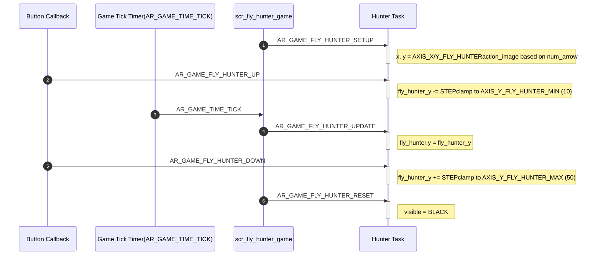
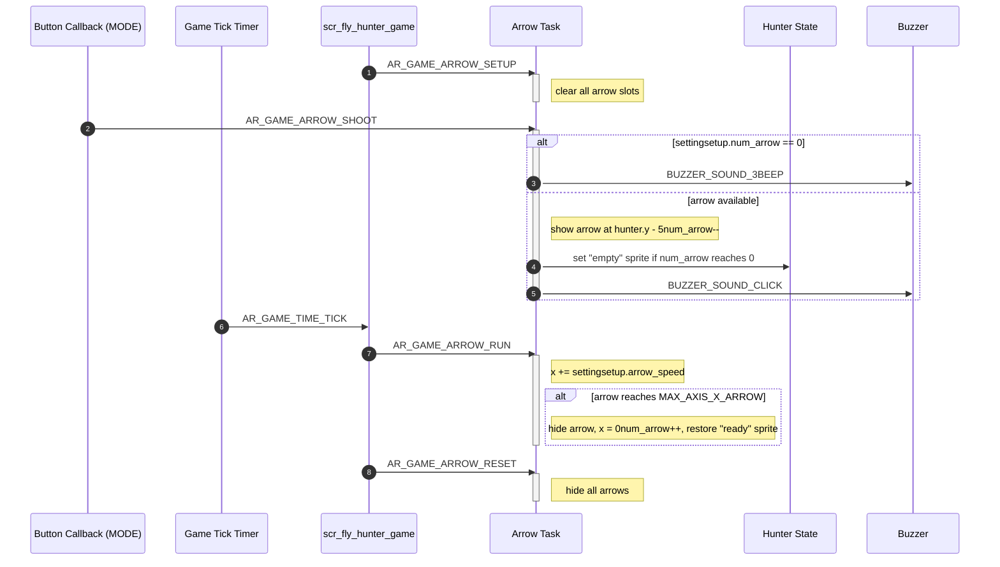
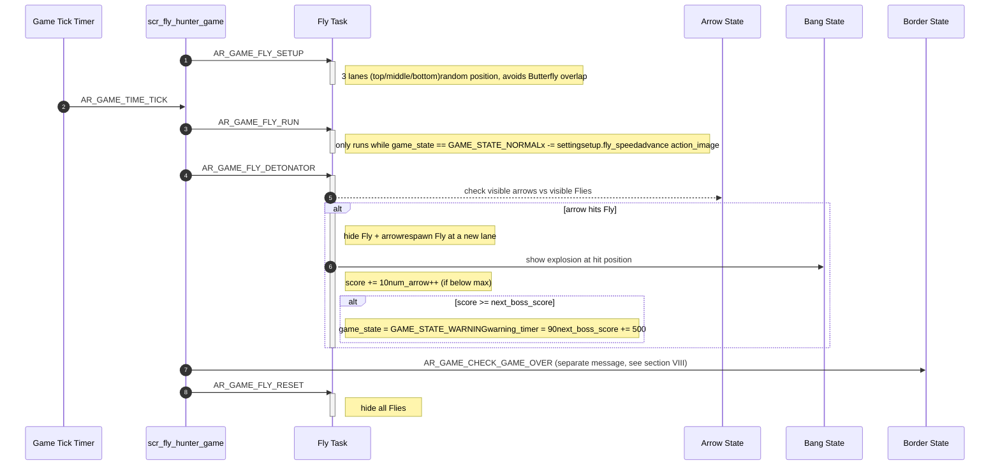
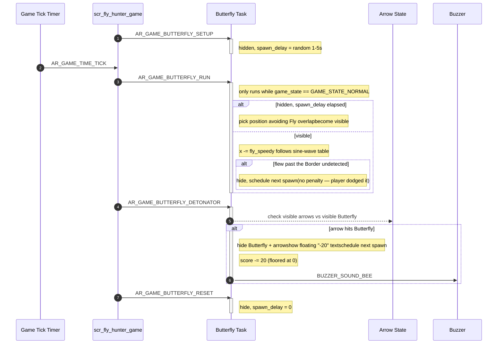
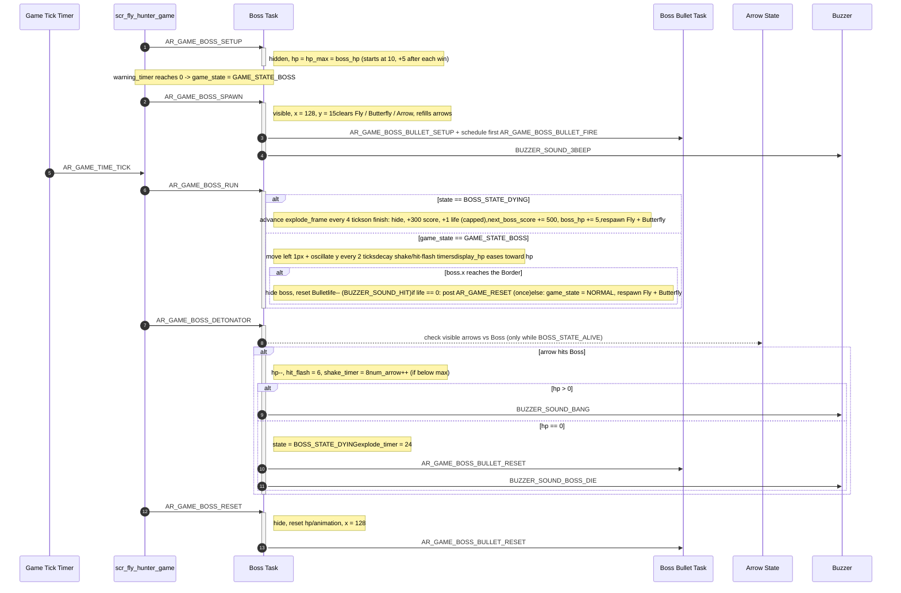
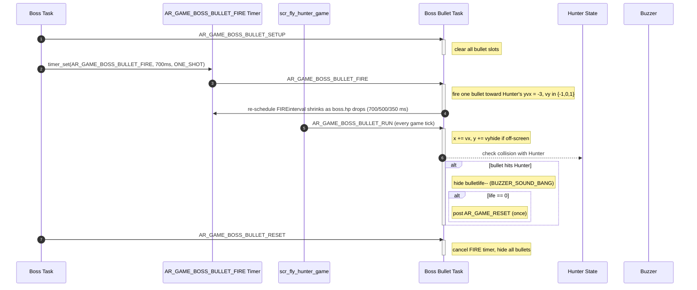
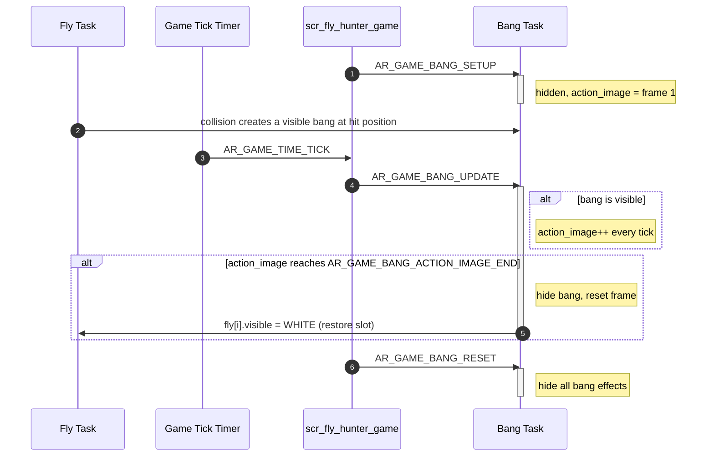
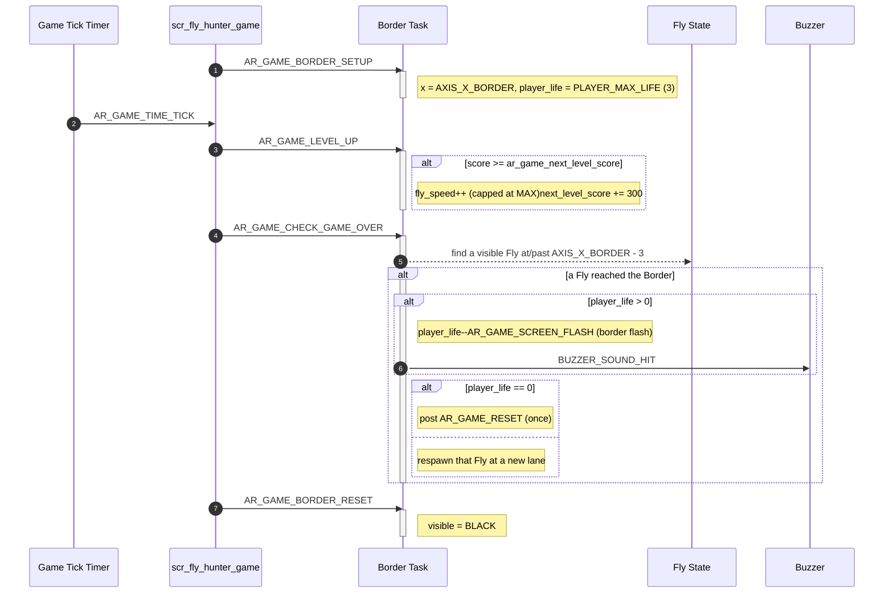

# Game Object Sequences

This document describes the runtime sequence of each game object in Fly Hunter. Each object is handled by its own AK task and receives signals from the screen task (`scr_fly_hunter_game.cpp`), button callbacks, timers, or other object tasks.

## I. Object Summary

| Object | Task ID | Handler | Source file | Main responsibility |
| --- | --- | --- | --- | --- |
| Hunter | `AR_GAME_FLY_HUNTER_ID` | `ar_game_fly_hunter_handle()` | `ar_game_fly_hunter.cpp` | Controls the player's vertical position and idle/shoot sprite. |
| Arrow | `AR_GAME_ARROW_ID` | `ar_game_arrow_handle()` | `ar_game_arrow.cpp` | Shoots arrows, moves active arrows, restores available arrow count. |
| Fly | `AR_GAME_FLY_ID` | `ar_game_fly_handle()` | `ar_game_fly.cpp` | Spawns Flies, moves them, checks collision with arrows, awards score. |
| Butterfly | `AR_GAME_BUTTERFLY_ID` | `ar_game_butterfly_handle()` | `ar_game_butterfly.cpp` | Spawns a decoy Butterfly on a sine-wave path; penalizes score if shot. |
| Boss | `AR_GAME_BOSS_ID` | `ar_game_boss_handle()` | `ar_game_boss.cpp` | Boss spawn/movement/HP/death, and the extra-life reward on defeat. |
| Boss Bullet | `AR_GAME_BOSS_BULLET_ID` | `ar_game_boss_bullet_handle()` | `ar_game_boss_bullet.cpp` | Fires bullets from the Boss toward the Hunter and checks impact. |
| Bang | `AR_GAME_BANG_ID` | `ar_game_bang_handle()` | `ar_game_bang.cpp` | Plays the explosion animation after a Fly is hit. |
| Border | `AR_GAME_BORDER_ID` | `ar_game_border_handle()` | `ar_game_border.cpp` | Checks level-up and game-over conditions for Flies. |

**Note:** there are **three independent paths** that can cost the player a life and post `AR_GAME_RESET`: a Fly reaching the Border (`ar_game_border.cpp`), the Boss itself reaching the Border (`ar_game_boss.cpp`), and a Boss Bullet hitting the Hunter (`ar_game_boss_bullet.cpp`). Each path posts `AR_GAME_RESET` **only once** per life-loss event — keep it that way (see [02-guide-coding-rule.md](./02-guide-coding-rule.md)) since Fly and Boss never move at the same time (`game_state` gates them), so only one path can be active per tick in practice.

## II. Hunter Object Sequence

The Hunter owns the player's vertical position. `AR_GAME_FLY_HUNTER_UP` / `_DOWN` update an internal `fly_hunter_y` target; the next `AR_GAME_FLY_HUNTER_UPDATE` (posted every game tick) copies it into the rendered `fly_hunter.y`.

## III. Arrow Object Sequence

Arrow receives shoot input from the MODE button (`AR_GAME_ARROW_SHOOT`). Every game tick, `AR_GAME_ARROW_RUN` moves visible arrows to the right; an arrow reaching the far edge is hidden and its slot returned to `settingsetup.num_arrow`.

> **Note:** `arrow_speed` is stored in `ar_game_setting_t` but is not exposed on the Settings screen — it is fixed at `AR_GAME_SETTING_ARROW_SPEED_DEFAULT` (5), because a slow arrow speed would significantly hurt the gameplay feel.

## IV. Fly Object Sequence

Fly is the main scoring target. On each tick, the screen posts `AR_GAME_FLY_RUN` (move + animate) then `AR_GAME_FLY_DETONATOR` (collision check against arrows).

## V. Butterfly Object Sequence

Butterfly is a decoy: it flies in from the right on a sine-wave path (`butterfly_sin_table`) and should be avoided, not shot.

## VI. Boss Object Sequence

The Boss only becomes active once `game_state` reaches `GAME_STATE_BOSS` (after the `GAME_STATE_WARNING` countdown finishes in `scr_fly_hunter_game.cpp`). It clears all Flies/Butterflies/Arrows on spawn, and rewards the player with **+300 score** and up to **+1 life** on defeat.

## VII. Boss Bullet Object Sequence

Boss Bullet is only active while `game_state == GAME_STATE_BOSS`. It fires itself on a self-rescheduling one-shot timer whose interval shortens as the Boss's HP drops (more aggressive at low HP).

## VIII. Bang Object Sequence

Bang is the explosion effect. It becomes visible when Fly detects a collision, and restores the matching Fly slot once its animation finishes.

## IX. Border Object Sequence

Border owns the "kill line" and drives the Fly-related level-up and game-over checks. (The Boss and Boss Bullet have their own, separate life-loss paths — see section I.)

## X. Code References

| Object | Source file | Header file |
| --- | --- | --- |
| Hunter | `application/sources/app/game/fly_hunter_game/ar_game_fly_hunter.cpp` | `ar_game_fly_hunter.h` |
| Arrow | `application/sources/app/game/fly_hunter_game/ar_game_arrow.cpp` | `ar_game_arrow.h` |
| Fly | `application/sources/app/game/fly_hunter_game/ar_game_fly.cpp` | `ar_game_fly.h` |
| Butterfly | `application/sources/app/game/fly_hunter_game/ar_game_butterfly.cpp` | `ar_game_butterfly.h` |
| Boss | `application/sources/app/game/fly_hunter_game/ar_game_boss.cpp` | `ar_game_boss.h` |
| Boss Bullet | `application/sources/app/game/fly_hunter_game/ar_game_boss_bullet.cpp` | `ar_game_boss_bullet.h` |
| Bang | `application/sources/app/game/fly_hunter_game/ar_game_bang.cpp` | `ar_game_bang.h` |
| Border | `application/sources/app/game/fly_hunter_game/ar_game_border.cpp` | `ar_game_border.h` |
| Gameplay screen (orchestrates all of the above) | `application/sources/app/screens/scr_fly_hunter_game.cpp` | `scr_fly_hunter_game.h` |
