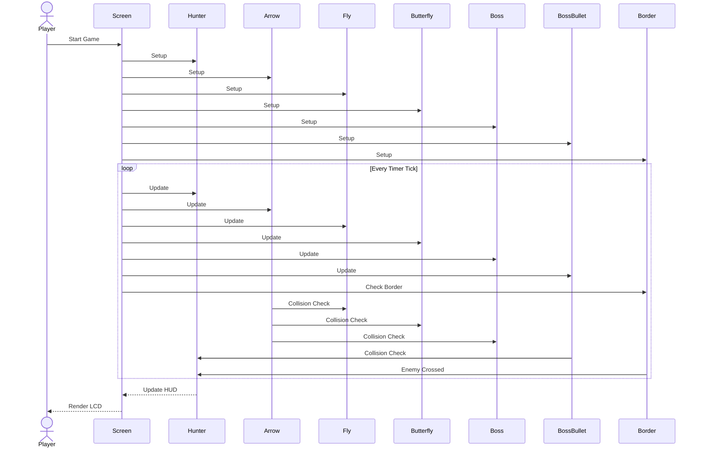
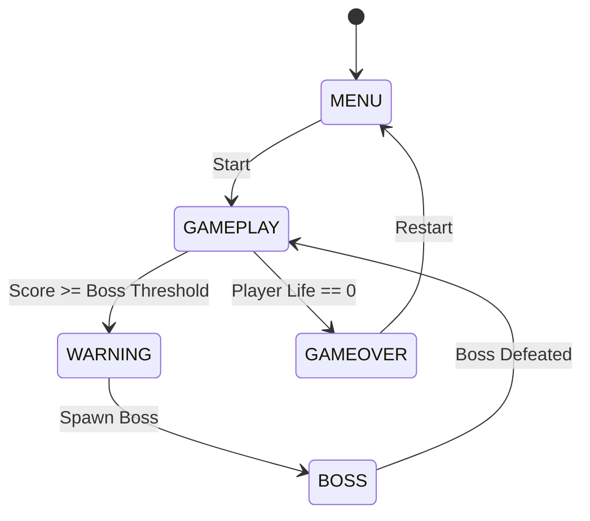

# Design Sequence - Runtime

This document describes the runtime execution flow of the **Fly Hunter Game**. The game is built on the **AK Framework**, where all gameplay logic is driven by asynchronous messages and periodic timer events. Every game object is implemented as an independent module and updated through the framework's event dispatcher.

---

# I. Runtime Architecture

The runtime architecture is composed of three major layers.

```
Application Layer
        │
        ▼
 Screen Manager
        │
        ▼
 Game Logic Layer
        │
        ▼
Object Managers
(Hunter, Arrow, Fly, Butterfly,
 Boss, Boss Bullet, Explosion)
        │
        ▼
View Renderer
        │
        ▼
 LCD Display
```

---

# II. Runtime Signal Processing

Every frame is generated from a periodic timer event.

```text
System Boot

        │

        ▼

SCREEN_ENTRY

        │

        ▼

Initialize Game Objects

        │

        ▼

Start Periodic Timer

        │

        ▼

AR_GAME_TIME_TICK

        │

        ▼

Update All Objects

        │

        ▼

Collision Detection

        │

        ▼

Update Score

        │

        ▼

Refresh Display

        │

        ▼

Repeat
```

---

# III. Screen Transition

The game contains several independent screens managed by the Screen Manager.

```text
Main Menu
    │
    ▼
Gameplay
    │
    ├────────► Game Over
    │              │
    │              ▼
    │         Main Menu
    │
    ├────────► High Score
    │              │
    │              ▼
    │         Main Menu
    │
    └────────► Settings
                   │
                   ▼
              Main Menu
```

---

# IV. Gameplay Runtime Sequence



---

# V. Runtime Update Order

The update order is fixed for every frame.

```
Hunter

↓

Arrow

↓

Fly

↓

Butterfly

↓

Boss

↓

Boss Bullet

↓

Explosion

↓

Collision Detection

↓

Score Update

↓

Border Check

↓

LCD Rendering
```

Maintaining a fixed execution order guarantees deterministic gameplay and simplifies debugging.

---

# VI. Collision Processing

Collision detection is executed after all object positions have been updated.

```text
Arrow

│

├────────► Fly

│

├────────► Butterfly

│

└────────► Boss

Boss Bullet

│

└────────► Hunter

Enemy

│

└────────► Border
```

Each collision generates an event which updates the corresponding game state.

---

# VII. Score Processing

```
Fly Destroyed

↓

+10 Score

────────────────────────────

Butterfly Destroyed

↓

-20 Score

────────────────────────────

Boss Defeated

↓

+100 Score
```

The score is updated immediately after collision processing.

---

# VIII. Boss Runtime

The boss does not appear immediately at game start.

Spawn rule:

```
500

↓

1000

↓

1500

↓

2000

↓

...
```

Boss lifecycle:

```text
Hidden

↓

Warning

↓

Spawn

↓

Move

↓

Shoot

↓

Receive Damage

↓

Destroyed

↓

Explosion

↓

Hidden
```

---

# IX. Player Life Runtime

The player begins with three hearts.

```
❤❤❤

↓

❤❤

↓

❤

↓

Game Over
```

A heart is lost when:

- A Fly reaches the border.
- A Boss Bullet hits the Hunter.

---

# X. Game Over Runtime

```text
Player Life == 0

↓

Stop Game Timer

↓

Save High Score

↓

Reset Objects

↓

Play Game Over Sound

↓

Switch Screen

↓

Game Over Screen
```

---

# XI. Timer Processing

The gameplay is entirely timer-driven.

```
AR_GAME_TIME_TICK

↓

Hunter Update

↓

Arrow Update

↓

Enemy Update

↓

Boss Update

↓

Collision

↓

Display Update
```

Only one periodic timer controls the main gameplay loop.

---

# XII. Rendering Flow

Rendering is separated from game logic.

```
Object Update

↓

View Renderer

↓

Frame Buffer

↓

OLED LCD

↓

Next Frame
```

This separation allows game logic to remain independent from the display driver.

---

# XIII. Message Flow

The AK Framework dispatches messages between modules.

```text
Timer

↓

Screen

↓

Hunter

↓

Arrow

↓

Fly

↓

Butterfly

↓

Boss

↓

Boss Bullet

↓

Explosion

↓

Border

↓

Renderer
```

Each object only processes the messages relevant to its own behavior.

---

# XIV. Runtime State Machine



---

# XV. Runtime Summary

The runtime system follows an **event-driven architecture** based on the AK Framework.

Key characteristics:

- Periodic timer-driven gameplay.
- Independent object modules.
- Message-based communication.
- Deterministic update order.
- Separate rendering pipeline.
- Finite State Machine (FSM) for screen management.
- Easy to extend with new enemies, power-ups, or game mechanics.
