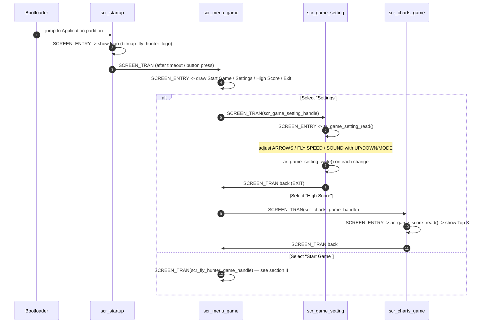
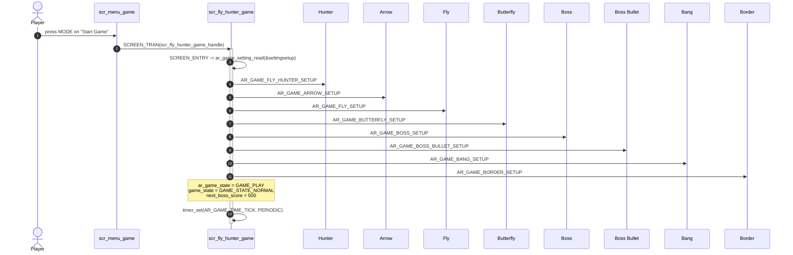
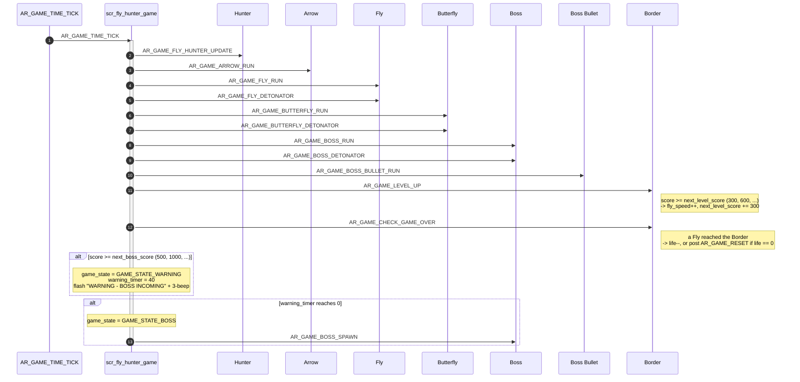
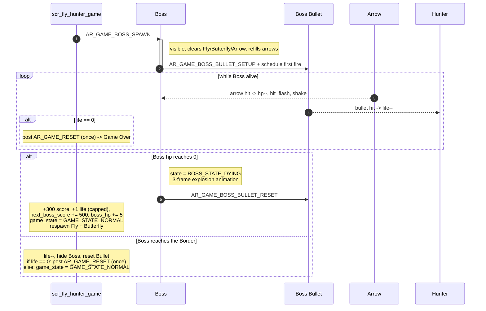
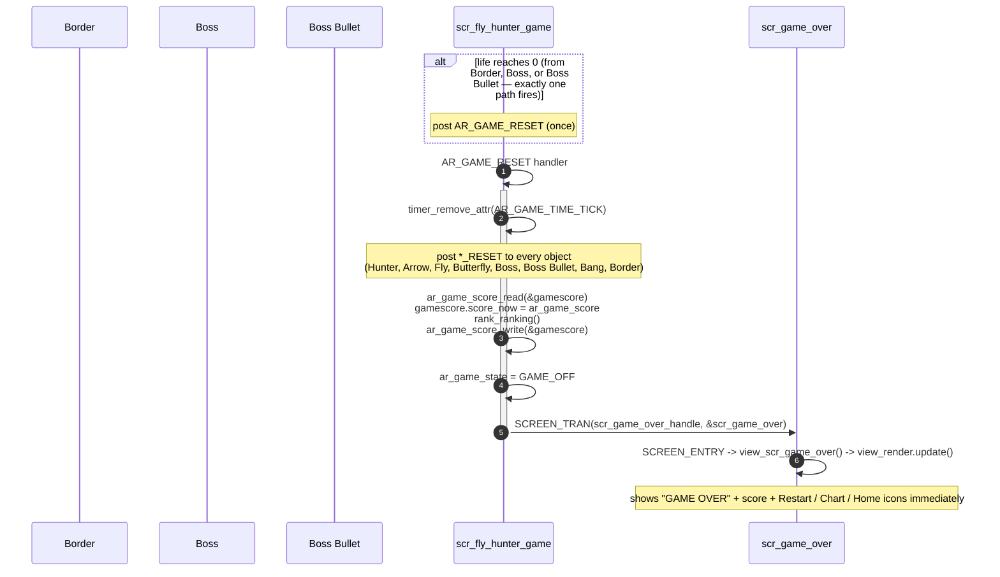
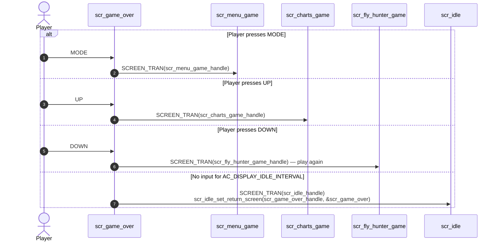

# Runtime Signal Processing

This document describes the end-to-end runtime message flow of Fly Hunter, from power-on to Game Over. The gameplay is driven by the AK framework's task/timer/message scheduler — every game object operates as an independent task and communicates only through runtime signals (see [02-guide-coding-rule.md](./02-guide-coding-rule.md) for the architecture rules behind this).

## I. Boot and Menu Flow

## II. Game Start — Object Initialization

## III. Main Gameplay Loop

## IV. Boss Encounter and Reward Loop

## V. Game Over Transition

This is the most bug-sensitive part of the runtime flow — see [02-guide-coding-rule.md](./02-guide-coding-rule.md) for the rules that keep it correct.

## VI. From Game Over

## VII. Code References

| Stage | Source file |
|---|---|
| Boot / Menu | `scr_startup.cpp`, `scr_menu_game.cpp` |
| Settings | `scr_game_setting.cpp` |
| Gameplay orchestration | `scr_fly_hunter_game.cpp` |
| Game Over | `scr_game_over.cpp` |
| High Score | `scr_charts_game.cpp` |
| Idle timeout | `scr_idle.cpp` |
| Per-object logic | `application/sources/app/game/fly_hunter_game/*.cpp` (see [03-design-sequence-object.md](./03-design-sequence-object.md)) |
